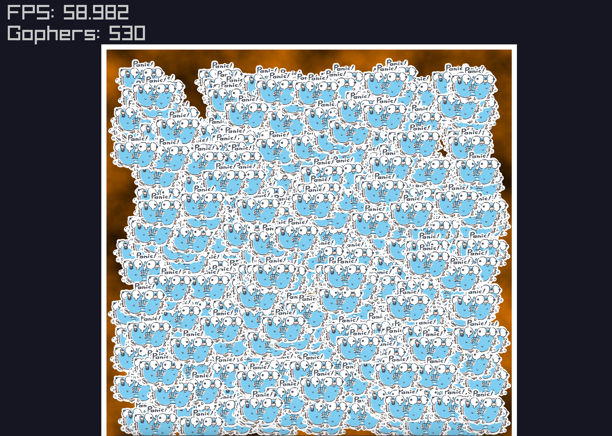

# Gopher swarm

This is my first program in **raylib go**, so I tried to make something funny.
Here it is, **thousands of Gophers bouncing** in a box. 
There is also perlin noise and hue color change.
    
## Run

```
go run main/main.go
```

## RTFM

Move camera with `WASD` or arrow keys.
Spawn Gophers with `Q`.

## Preview image
With just a few of Gophers.


## Credit

- [Gopher Panic image by tottie000](https://github.com/tottie000/GopherIllustrations/blob/main/Gopher_Illustrations/panic.png)
